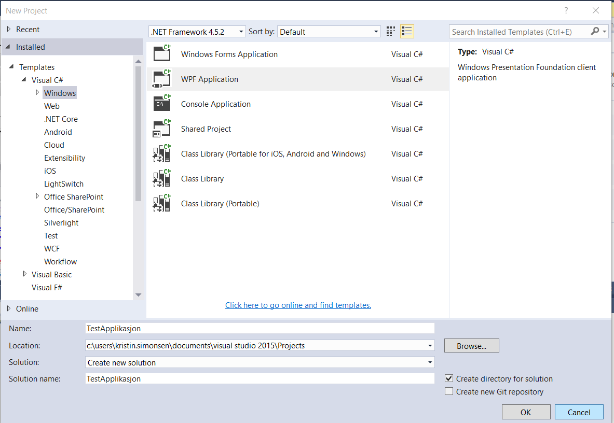
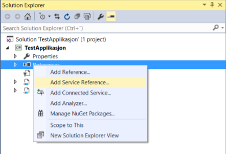
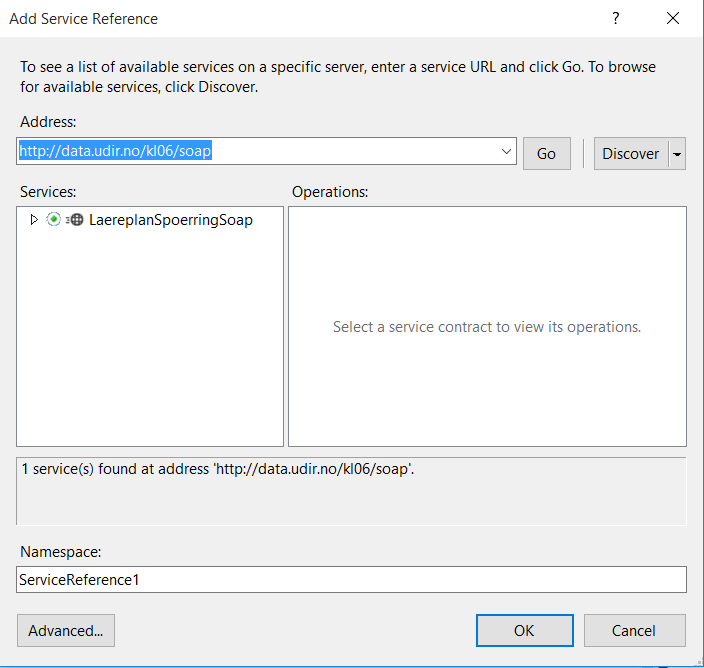

## SOAP-grensesnitt {#soap-grensesnitt}

Her følger et enkelt eksempel på hvordan du kan ta i bruk SOAP-grensesnittet i en .Net-basert applikasjon.

Figur 5: Opprett en ny applikasjon

Figur 6: Legg til en ny tjeneste-referanse

Figur 7: Oppgi URL (http://beta-data.udir.no/KL06/soap), trykk "GO" og OK

### Endringer i konfigurasjon {#endringer-i-konfigurasjon}

I dette tilfellet benytter vi en WCF proxy-klasse for å få tilgang til tjenesten. Denne har en del standard innstillinger, som blant annet går på hvor mange elementer man kan laste ned, og størrelsen på “pakken” fra tjenesten. Grep-tjenesten kan i utgangspunktet gi en oversikt over alle læreplaner, og dette vil overstige standardinnstillingene. For å endre dette – gå til applikasjonens app.config. Der vil du finne noen linjer som ligner på disse:


<basicHttpBinding>
  <binding name="GrepSoapBinding_GrepSoap" closeTimeout="00:01:00" openTimeout="00:01:00" receiveTimeout="00:10:00" sendTimeout="00:01:00" allowCookies="false" bypassProxyOnLocal="false" hostNameComparisonMode="StrongWildcard" maxBufferSize="65536" maxBufferPoolSize="524288" maxReceivedMessageSize="65536" messageEncoding="Text" textEncoding="utf-8" transferMode="Buffered" useDefaultWebProxy="true">
    <readerQuotas maxDepth="32" maxStringContentLength="8192" maxArrayLength="16384" maxBytesPerRead="4096" maxNameTableCharCount="16384" />
    <security mode="None">
      <transport clientCredentialType="None" proxyCredentialType="None" realm="" />
      <message clientCredentialType="UserName" algorithmSuite="Default" />
    </security>
  </binding>
</basicHttpBinding>


Her må/bør du endre maxBufferSize og maxReceivedMessageSize til mer enn 65536 tegn, i tillegg til å øke maks antall objekter i en liste. Et forslag på hvordan konfigurasjonen på denne applikasjonen kan se ut er slik:


<system.serviceModel>
  <bindings>
    <basicHttpBinding>
      <binding name="GrepSoapBinding_GrepSoap" closeTimeout="00:01:00" openTimeout="00:01:00" receiveTimeout="00:10:00" sendTimeout="00:01:00" allowCookies="false" bypassProxyOnLocal="false" hostNameComparisonMode="StrongWildcard" maxBufferSize="6553600" maxBufferPoolSize="524288" maxReceivedMessageSize="6553600" messageEncoding="Text" textEncoding="utf-8" transferMode="Buffered" useDefaultWebProxy="true">
        <readerQuotas maxDepth="32" maxStringContentLength="8192" maxArrayLength="16384" maxBytesPerRead="4096" maxNameTableCharCount="16384" />
        <security mode="None">
          <transport clientCredentialType="None" proxyCredentialType="None" realm="" />
          <message clientCredentialType="UserName" algorithmSuite="Default" />
        </security>
      </binding>
    </basicHttpBinding>
  </bindings>
  <client>
    <endpoint address="http://beta-data.udir.no/soap" binding="basicHttpBinding" **behaviorConfiguration="GrepBehavior"** bindingConfiguration="GrepSoapBinding_GrepSoap" contract="Læreplanspørringer.GrepSoap" name="GrepSoapBinding_GrepSoap" />
  </client>
  <behaviors>
    <endpointBehaviors>
      <behavior name="GrepBehavior">
        <dataContractSerializer maxItemsInObjectGraph="2147483647" />
      </behavior>
    </endpointBehaviors>
  </behaviors>
</system.serviceModel>


### Kode {#kode}

Nå har vi det vi trenger for å kunne bruke tjenestene. Det som gjenstår er litt kode for å faktisk kalle tjenesten.

I eksempelet her vil vi lage en WPF-basert applikasjon for å kunne søke opp læreplaner basert på tittel og gyldig fra-datoen på læreplanen. Vi vil også kunne hente en valgt læreplans vurdering og vise denne.

Først definerer vi brukergrensesnittet (XAMLen).

Her oppretter vi et enkelt stackpanel med en tekstboks for å skrive inn tittel, en datovelger for å velge gyldig fra, en knapp for å starte søk, et grid for å vise søkeresultat (med tittel, kode og gyldig fra som kolonner) og en web-browser for å vise html:


<Window x:Class="TestApplikasjon.MainWindow" xmlns="http://schemas.microsoft.com/winfx/2006/xaml/presentation" xmlns:x="http://schemas.microsoft.com/winfx/2006/xaml" Title="MainWindow" Width="973" Closing="WindowClosing">
  <Grid>
    <StackPanel>
      <Label Content="Tittel å søke på"></Label>
      <TextBox Name="txtTittel"></TextBox>
      <Label Content="Gyldig Fra å søke på"></Label>
      <DatePicker Name="dtpGyldigFra"></DatePicker>
      <Button Name="btnSøk" Content="Søk" HorizontalAlignment="Left" Width="40" Click="BtnSøkClick"></Button>
      <ScrollViewer MaxHeight="150">
        <DataGrid Name="dgSøkeresultat" AutoGenerateColumns="False" SelectionChanged="DgSøkeresultatSelectionChanged">
          <DataGrid.Columns>
            <DataGridTextColumn Binding="{Binding tittel}" Header="Tittel"></DataGridTextColumn>
            <DataGridTextColumn Binding="{Binding kode}" Header="Kode"></DataGridTextColumn>
            <DataGridTextColumn Binding="{Binding gyldigfra}" Header="Gyldig fra"></DataGridTextColumn>
          </DataGrid.Columns>
        </DataGrid>
      </ScrollViewer>
      <Label Content="Vurdering" FontWeight="Bold"></Label>
      <ScrollViewer MaxHeight="150">
        <WebBrowser Name="webBrowser"></WebBrowser>
      </ScrollViewer>
    </StackPanel>
  </Grid>
</Window>


Deretter definerer vi koden for å søke, og for å vise vurdering:


public partial class MainWindow : Window
{
  public MainWindow()
  {
    InitializeComponent();
  }
  private GrepSoapClient Client { get; set; }
  const string HtmlHeadere = @"<html> <head> <meta http-equiv='Content-Type' content='text/html;charset=UTF-8'> </head> <body>";
  const string HtmlSluttHeader = @"</body> </html>";
  // Kode som kjøres når søk-knappen klikkes
  private void BtnSøkClick(object sender, RoutedEventArgs e)
  {
    InitierProxy();
    try
    {
    // Kjører FinnPlaner-metoden med tittel og gyldig-fra som parametere
    dgSøkeresultat.ItemsSource = this.Client.FinnPlaner(
      new laereplansoekrequest { gyldigfra = dtpGyldigFra.DisplayDate, tittel = txtTittel.Text }).treff;
    }
    catch (Exception ex)
    {
      if (Client.State == CommunicationState.Faulted)
      {
        this.Client.Abort();
      }
      MessageBox.Show(ex.ToString());
    }
  }
  private void DgSøkeresultatSelectionChanged(object sender, SelectionChangedEventArgs e)
  {
    InitierProxy();
    try
    {
      // Finner koden fra det valgte søkeresultatet i Grid'en
      var valgtKode = e.AddedItems.Cast<laereplansoekeresultat>().Select(soekeresultat => soekeresultat.kode).FirstOrDefault();
      // Henter hele læreplanen fra tjenesten (HentPlanFraKode), og velger ut vurderingen på 'default'-språk (fastsatt språk)
      var vurdering = Client.HentPlanFraKode(new hentlaereplanfrakoderequest { Kode = valgtKode }).vurdering.Where(v => v.noekkel == "default").Select(v => v.verdi).FirstOrDefault();
      // Viser vurderingen i en browser
      if (vurdering != null)
      webBrowser.NavigateToString(HtmlHeadere + vurdering + HtmlSluttHeader);
    }
    catch (Exception ex)
    {
      if (Client.State == CommunicationState.Faulted)
      {
        this.Client.Abort();
      }
      MessageBox.Show(ex.ToString());
    }
  }
  private void InitierProxy()
  {
    if (Client == null || Client.State == CommunicationState.Faulted)
      Client = new GrepSoapClient();
  }
  private void WindowClosing(object sender, System.ComponentModel.CancelEventArgs e)
  {
    if (Client != null && Client.State == CommunicationState.Opened)
      Client.Close();
  }
}


### Demonstrasjon {#demonstrasjon}

Når vi kjører denne applikasjonen, kan vi filtrere på tittel og gyldig fra. Om vi oppgir “Natur” som tittel og 01.01.2008 som gyldig fra, vil vi få følgende resultat:

Figur 8: Testing av applikasjon
