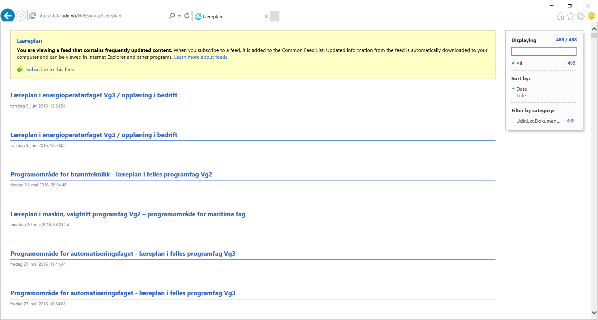
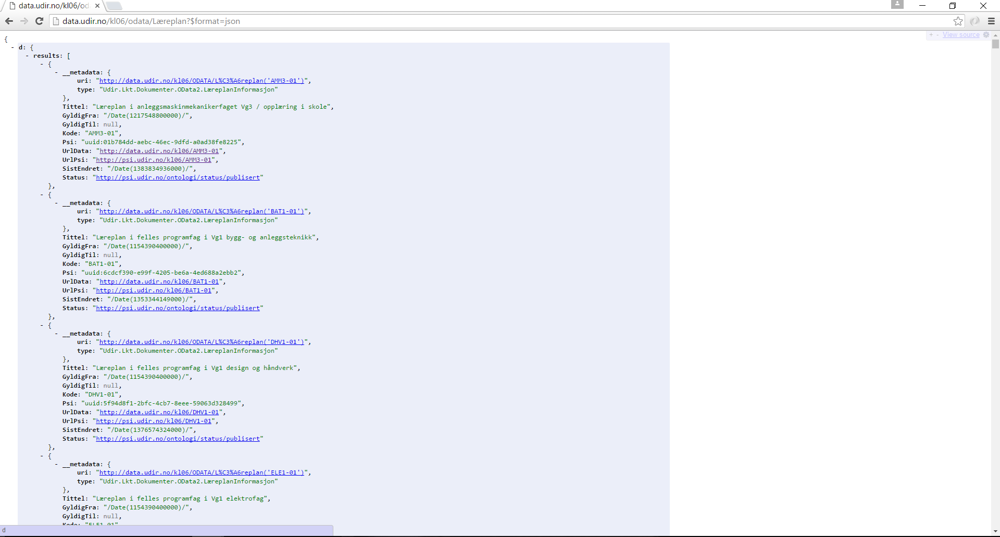

## OData og læreplaner {#odata-og-l-replaner}

For å spørre etter læreplaner, oppgir du URLen [http://data.udir.no/kl06/odata/Læreplan](http://data.udir.no/kl06/odata/Læreplan)

Figur 3: Læreplaner levert som RSS

Figur 4: Læreplan levert som JSON

På læreplan har vi følgende felt å jobbe med:

| **Felt** | **Beskrivelse** | **Eksempel** |
| --- | --- | --- |
| Tittel | Læreplanens tittel på fastsatt språk | [http://data.udir.no/kl06/odata/Læreplan?$filter=endswith(Tittel,'engelsk')](http://data.udir.no/kl06/odata/Læreplan?$filter=endswith%28Tittel,'engelsk'%29) (Returnerer alle læreplaner hvis tittel slutter med “_engelsk”)_ |
| Kode | Læreplanens kode | [	http://data.udir.no/kl06/odata/Læreplan?$filter=(Kode eq 'SFS2-01')](http://data.udir.no/kl06/odata/Læreplan?$filter=%28Kode eq 'SFS2-01'%29) |
| Psi | Læreplanens identifikator (eller PSI i Grep) | [http://data.udir.no/kl06/odata/Læreplan?$filter=(Psi eq 'uuid:3e9bd273-f1cd-4631-854e-1229e384938c')](http://data.udir.no/kl06/odata/Læreplan?$filter=%28Psi eq 'uuid:3e9bd273-f1cd-4631-854e-1229e384938c'%29) |
| UrlData | Url til detaljert informasjon om læreplanen for maskinell behandling | [http://data.udir.no/kl06/odata/Læreplan?$filter=(Psi eq 'uuid:3e9bd273-f1cd-4631-854e-1229e384938c')&$select=UrlData&$format=json](http://data.udir.no/kl06/odata/Læreplan?$filter=%28Psi eq 'uuid:3e9bd273-f1cd-4631-854e-1229e384938c'%29&$select=UrlData&$format=json) |
|  SistEndret | Når læreplanen sist ble oppdatert | [http://data.udir.no/kl06/odata/Læreplan?$filter=(SistEndret gt datetime'2011-01-01')](http://data.udir.no/kl06/odata/Læreplan?$filter=%28SistEndret gt datetime'2011-01-01'%29) |
| Status | Status til læreplanen | [http://data.udir.no/kl06/odata/Læreplan?$filter=(Status eq 'http://psi.udir.no/ontologi/status/utgaatt')](http://data.udir.no/kl06/odata/Læreplan?$filter=%28Status eq 'http://psi.udir.no/ontologi/status/utgaatt'%29) |
