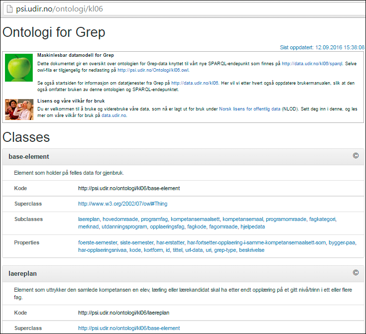
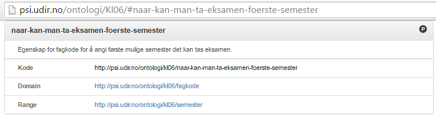

# Ontologi/maskinlesbar datamodell og .owl {#Ontologi/maskinlesbar datamodell og .owl}

Alle typer og egenskaper \(classes and properties\) i datamodellen til Grep er URL-baserte, og er derfor unike identifikatorer som kan brukes i API-sammenheng og i spørringer. Disse er systematisert i en ontologi som det kan navigeres i for den som ønsker å skaffe seg en oversikt over hvordan typene og egenskapene i datamodellen henger sammen \(se også illustrasjonen i innledningen til dette kapittelet\).

## Ontologi, startside:

Denne oversiktens startside er http://psi.udir.no/ontologi/kl06/. Dette er den "menneskelesbare" delen av ontologien. Engelsk versjon er tilgjengelig på http://psi.udir.no/ontologi/kl06?culture=en.

Denne siden er delt i tre deler,

* Først en kort introduksjon og informasjon om lisens og våre vilkår for bruk
  * og lenke til den maskinlesbare [.owl-fila](http://psi.udir.no/Ontologi/kl06.owl) \(enten fra teksten eller høyreklikk på "Sist oppdatert" øverst på siden\)
* så en liste over typer/"classes"
  * der hver type er gitt en definisjon
  * hvilken url-baserte kode den har i Grep
  * og videre, klikkbare referanser til "superclass" \(typen hierarkisk over den gjeldende typen\)
* og til slutt en liste over egenskaper/"properties" som finnes i modellen,
  * der hver egenskap er gitt en definisjon/forklaring
  * hvilken url-baserte kode den har i Grep
  * "Domain"; url-referanse til typen\(e\) den er egenskap for
  * "Range"; hvilke\(n\) type eller egenskap som opptrer som axiom/postulat i sammenhengen \(se illustrasjonen med eksempel nedenfor\)

  
_Eksempel: Typen "fagkode" har en egenskap, "naar-kan-man-ta-eksamen-foerste-semester", som angir en forekomst av typen "semester"_  
_\[alternativ bildetekst: Det er forekomster av typen "semester" som listes opp for å angi egenskapen "naar-kan-man-ta-eksamen-foerste-semester" for en forekomst av typen "fagkode".\]_  
\*

Man kan navigere opp og ned i dette dokumentet mellom typer og egenskaper og på den måten gjøre seg kjent med hvordan elementene henger sammen. Men legg spesielt merke til den første typen som listes opp: "Base-element" \([http://psi.udir.no/ontologi/Kl06/\#base-element](http://psi.udir.no/ontologi/Kl06/#base-element)\). Dette er en type vi ikke finner i de øvrige grensesnittene for Grep, men som i denne sammenheng er et element som gjør at egenskaper som "kode", "id", "tittel" og "grep-type" kan gjenbrukes som egenskaper for flere typer, som for eksempel "laereplan", "hovedomraade", "fagkode" osv.

Den har også en "Superclass" utenfor vårt eget domene, siden vi her refererer til [http://www.w3.org/2002/07/owl\#Thing](http://www.w3.org/2002/07/owl#Thing). Det er en blant annet en RDF-måte å uttrykke at subklassene \(laereplan, fagkoder osv.\) er vårt domenes hoved-typer.

En mer avansert måte å gjøre seg kjent med typer og egenskaper og hvordan disse henger sammen, kan gjøres med SPRARQL-spørringer. Her kan brukeren skaffe seg ytterligere oversikt over muligheter for koblinger mellom elementene. Se mer om dette i kapittelet om SPARQL-endepunktet.

