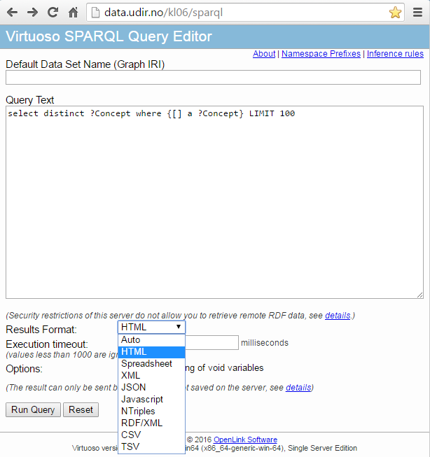

# SPARQL-endepunktet
I dette kapittelet vil vi mer eller mindre rett på sak, og vise hvordan du bruke Greps SPARQL-endepunkt
- til å skaffe deg oversikt over hvilke data som er tilgjengelig via dette grensesnittet 
- kjøre spørringer som du kan bruke videre i programmering

Grudigere dokumentasjon om SPARQL generelt, kan du finne på [W3C](https://www.w3.org/TR/sparql11-overview/) sine sider.

Greps SPARQL-grensesnitt nås på endepunktet [http://data.udir.no/kl06/sparql/](http://data.udir.no/kl06/sparql/):

*Forsiden til SPARQL-endepunkt med ferdig utfylt spørring: "Vis meg hvilke konsepter du har" (velg hvilket format du ønsker resultatet i, og klikk "Run Query")*

Resultatet av denne "standard-spørringen" lister opp alle "konsepter" som er tilgjengelige via Greps SPARQL-grensesnitt. Her vil eksterne skjemaer (som f.eks. http://www.openlinksw.com/schemas) eller ontologier (f. eks. http://www.w3.org/2002/07/owl#Ontology) listes opp sammen med Greps egne Typer.

Neste del gir tips til hvordan du kan ta i bruk SPARQL-endepunktet.