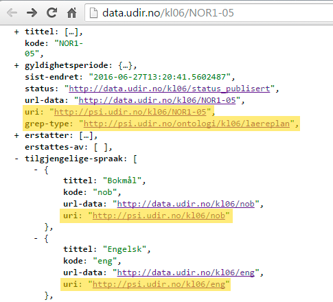

# RDF/SPARQL-grensesnitt og ontologi {#sparql-grensesnitt og ontologi}
Grep tilbyr et RDF/SPARQL-grensesnitt som består av følgende komponenter:
* **Ontologi/maskinlesbar datamodell:** http://psi-udir.no/ontologi/kl06/
 * **Oppslag på type:** http://psi.udir.no/ontologi/kl06/[navn_på_type],
eksempel:
http://psi.udir.no/ontologi/kl06/laereplan 
eller: http://psi.udir.no/ontologi/kl06#laereplan
Denne inneholder definisjon av typer og egenskaper, samt modell-referanser
 * **Ontologien som nedlastbar owl-fil til maskinell behandling:** http://psi.udir.no/Ontologi/kl06.owl
* **Oppslag på PSI-adresser for data-elementer:** (http://psi.udir.no/kl06/[navn_på_element], eksempel:
http://psi.udir.no/kl06/NOR1-05)
* **SPARQL-endepunkt:**
http://data.udir.no/kl06/sparql

```NB: SPARQL-endepunktet kan ha noe nedetid mellom kl. 19:00 og 20:30 i forbindelse med tanking av data til Virduoso-databasen```

Disse komponentene er nærmere beskrevet nedenfor, men først noen ord om hvordan disse er tilknyttet de øvrige grensesnittene for Grep.

Ved for eksempel å lese .json-representasjonen av 
["Læreplan i Norsk", NOR1-05](http://data.udir.no/kl06/NOR1-05), kjenner vi igjen URLene som nevnes i oversiktene over. Se illustransjonen nedenfor:



*Ontologi og URI-oppslag/PSI-adresser i kl06 kan nå brukes til å skaffe seg oversikt (for mennesker) eller brukes som API (for maskiner)*.


