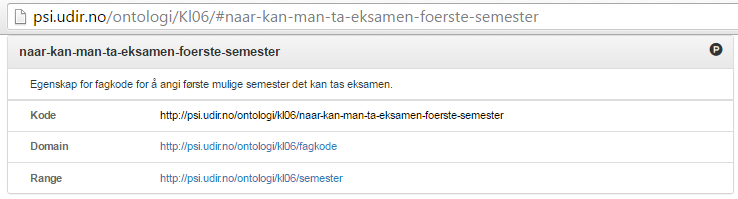

# RDF/SPARQL-grensesnitt og ontologi {#sparql-grensesnitt og ontologi}
Grep tilbyr også et RDF/SPARQL-grensesnitt som består av følgende komponenter:
* **Ontologi/maskinlesbar datamodell:** http://psi-udir.no/ontologi/kl06/
* * **Oppslag på type:** http://psi.udir.no/ontologi/kl06/[navn_på_type],
eksempel:
http://psi.udir.no/ontologi/kl06/laereplan 
eller: http://psi.udir.no/ontologi/kl06#laereplan
Denne inneholder definisjon av typer og egenskaper, samt modell-referanser
* * **Ontologien som nedlastbar owl-fil til maskinell behandling:** http://psi.udir.no/Ontologi/kl06.owl
* **Oppslag på PSI-adresser for data-elementer:** (http://psi.udir.no/kl06/[navn_på_element], eksempel:
http://psi.udir.no/kl06/NOR1-05)
* **SPARQL-endepunkt:**
http://data.udir.no/kl06/sparql

Disse komponentene er nærmere beskrevet nedenfor, men først noen ord om hvordan disse er tilknyttet de øvrige grensesnittene for Grep.

Ved for eksempel å lese .json-representasjonen av 
["Læreplan i Norsk", NOR1-05](http://data.udir.no/kl06/NOR1-05), kjenner vi igjen URLene som nevnes i oversiktene over. Se illustransjonen nedenfor:

*Ontologi og URI-oppslag/PSI-adresser i kl06 kan nå brukes til å skaffe seg oversikt (for mennesker) eller brukes som API (for maskiner)*

## Ontologi/maskinlesbar datamodell og .owl {##Ontologi/maskinlesbar datamodell og .owl}
Alle typer og egenskaper (classes and properties) i datamodellen til Grep er URL-baserte, og er derfor unike identifikatorer som kan brukes i API-sammenheng og i spørringer. Disse er systematisert i en ontologi som det kan navigeres i for den som ønsker å skaffe seg en oversikt over hvordan typene og egenskapene i datamodellen henger sammen (se også illustrasjonen i innledningen til dette kapittelet). 

### Ontologi, startside:
Denne oversiktens startside er [http://psi.udir.no/ontologi/kl06/](http://psi.udir.no/ontologi/kl06/). Dette er den "menneskelesbare" delen av ontologien.

Denne siden er delt i tre deler,
* Først en kort introduksjon og informasjon om lisens og våre vilkår for bruk
* så en liste over typer/"classes"
* * der hver type er gitt en definisjon
* * hvilken url-baserte kode den har i Grep
* * og videre, klikkbare referanser til "superclass" (typen hierarkisk over den gjeldende typen)
* og til slutt en liste over egenskaper/"properties" som finnes i modellen,
* * der hver egenskap er gitt en definisjon/forklaring
* * hvilken url-baserte kode den har i Grep
* * "Domain"; url-referanse til typen(e) den er egenskap for
* * og til slutt "Range"; hvilke(n) type eller egenskap som opptrer som axiom/postulat i sammenhengen (se illustrasjonen med eksempel nedenfor)

*Eksempel: Typen "fagkode" har en egenskap, "naar-kan-man-ta-eksamen-foerste-semester", som angir en forekomst av typen "semester"*
*[alternativ bildetekst: Det er forekomster av typen "semester" som listes opp for å angi egenskapen "naar-kan-man-ta-eksamen-foerste-semester" for en forekomst av typen "fagkode".]*
*

Man kan navigere opp og ned i dette dokumentet mellom typer og egenskaper og på den måten gjøre seg kjent med hvordan elementene henger sammen. Men legg spesielt merke til den første typen som listes opp: "Base-element" (http://psi.udir.no/ontologi/Kl06/#base-element). Dette er en type vi ikke finner i de øvrige grensesnittene for Grep, men som i denne sammenheng er et element som gjør at egenskaper som "kode", "id", "tittel" og "grep-type" kan kjenbrukes som egenskaper for flere typer, som for eksempel "laereplan", "hovedomraade", "fagkode" osv.

Den har også en "Superclass" utenfor vårt eget domene, siden vi her refererer til http://www.w3.org/2002/07/owl#Thing. Det er en RDF-måte å uttrykke at subklassene (laereplan, fagkoder osv.) er vårt domenes hoved-typer.*[TODO: kanskje også skrive noe om hvordan vi på denne måten kan koble oss til skjemaer på internett og på den måten koble oss til, ikke bare internett som nettverk av dokumenter, men også nettverk av data?]*

En mer avansert måte å gjøre seg kjent med typer og egenskaper og hvordan disse henger sammen, kan gjøres med SPRARQL-spørringer. Her kan brukeren skaffe seg ytterligere oversikt over muligheter for koblinger mellom elementene. Mer om det i kapittelet om SPARQL. 

### Oppslag på URI (psi-adresser) for data-elementer:
Ontologien beskriver datamodellen, mens oppslag på URI-verdien til de enkelte dataelementene (som består av psi-adresser), gir følgende informasjon:
- **URI:** etter formen http://beta-psi.udir.no/kl06/[kode], for eksempel http://beta-psi.udir.no/kl06/NOR1-05
- **Type:** Angir hvilken type det oppslåtte elementet er (hvilken plass det har i ontologien)
- **Referanse til ulike data-format elementet kan hentes:** Alltid JSON og XML, men for læreplan kan elementene i tillegg hentes som .pdf (i praksis kan disse også hentes som .doc, .docx, .rtf og "ren" .html)

[*illustrasjon: oppslag på [http://psi.udir.no/kl06/NOR1-05](http://psi.udir.no/kl06/NOR1-05)*]

