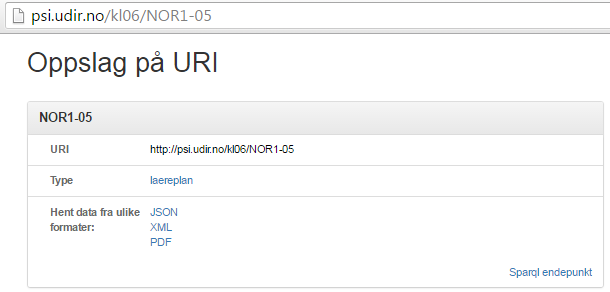

# URL-syntaks for ontologien og PSI-oppslag

Siden det meste av kodeverket til Grep er URL-basert, kan det være nyttig å kjenne til hvordan vi har lagt opp syntaksen for disse.

## URL-syntaks for ontologien:

Vi har valgt å legge ontologien for Grep \(kl06\) på følgende URL, og med følgende syntaks:  
[http://psi-udir.no/ontologi/kl06/\[en\_gitt\_kode\_for\_enten\_type\_eller\_egenskap\]](http://psi-udir.no/ontologi/kl06/[en_gitt_kode_for_enten_type_eller_egenskap]/)  
Forklaring på hvert ledd:

* **psi**: \(published subject identifier\) for å skille det fra data-elementer \(som ligger under data.udir.no\) og på den måten markere at det har med modellen å gjøre
* **.udir.no/ontologi/**: Teoretisk kan udir.no ha sin egen, overordnede ontologi i fremtiden, men her snakker vi om 
* **kl06/**: som er Greps ontologi \(i teorien kan andre prosjekter i Udir-domenet opprette sine egne ontologier etter formen [http://psi.udir.no/ontologi/\[navn\_på\_spesifikk\_ontologi\_i\_udir-domenet\]](http://psi.udir.no/ontologi/[navn_på_spesifikk_ontologi_i_udir-domenet]%28http://psi.udir.no/ontologi/[navn_på_spesifikk_ontologi_i_udir-domenet]%28http://psi.udir.no/ontologi/[navn_på_spesifikk_ontologi_i_udir-domenet%29%29]/)

## URL-syntaks for oppslag på URI \(psi-adresser til data-elementer\):

Ontologien beskriver datamodellen, mens oppslag på URI-verdien til de enkelte dataelementene \(som består av psi-adresser\), gir følgende informasjon:

* **URI:** etter formen [http://psi.udir.no/kl06/\[kode\]](http://psi.udir.no/kl06/[kode]), for eksempel[ http://psi.udir.no/kl06/NOR1-05](http://psi.udir.no/kl06/NOR1-05)
* **Type:** Angir hvilken type det oppslåtte elementet er \(hvilken plass det har i ontologien\)
* **Referanse til ulike data-format elementet kan hentes:** Alltid JSON og XML, men for læreplan kan elementene i tillegg hentes som .pdf \(i praksis kan disse også hentes som .doc, .docx, .rtf og "ren" .html\)

_oppslag på _[_http://psi.udir.no/kl06/NOR1-05_](http://psi.udir.no/kl06/NOR1-05)  
\*

